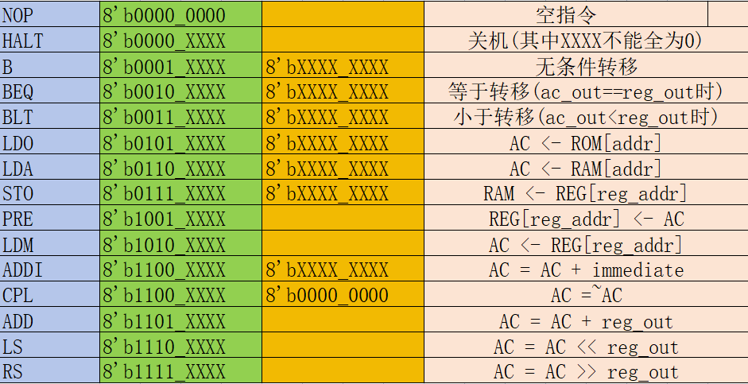

# 项目起因
### 在观看计算机组成原理的视频时，听到了“在早期，部件之间用分散方式连接。”很感兴趣，于是手动实现了一个部件分散连接的8位cpu。

# 工程文件
### 使用vivado创建和开发工程。其中设计文件位于.\8_bits_cpu.srcs\sources_1\new，仿真文件位于.\8_bits_cpu.srcs\sim_1\new。

# 指令集
## (一)指令集格式

## (二)指令集内容

# 设计思路
### 可以参考工程根目录下的8_bits_cpu.emmx(请使用MindMaster打开)